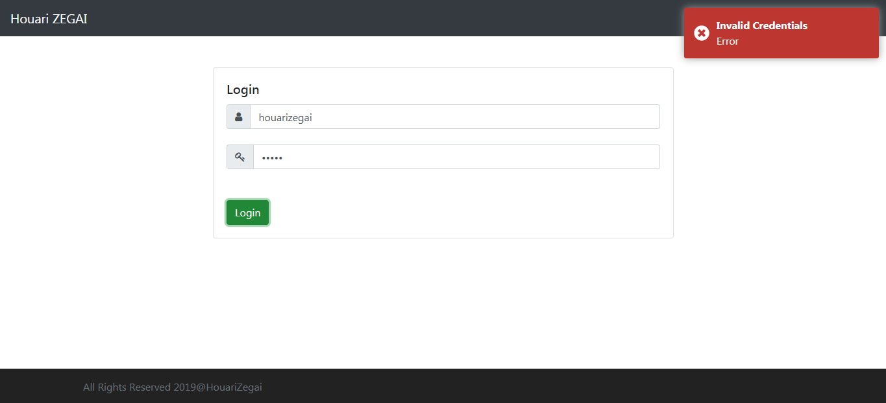
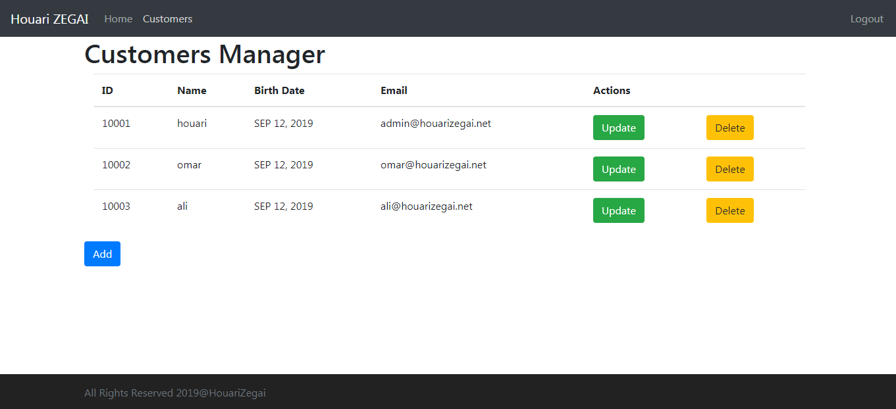
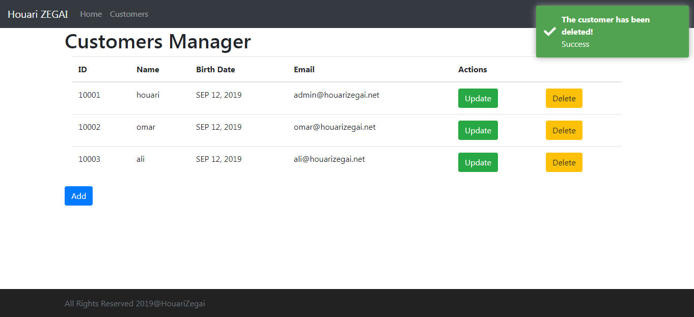

# Customer Relationship Managment (CRUD)
Aplicação FullStack completa usando Angular e SpringBoot (API RestFull).

### Used Technologies & Tools
* Front-end
  * Angular 8.
  * Bootstrap.
* Back-end
  * SpringBoot 2.x.x (Making REST API) [Java 8].
  * Spring Security (Authentication & JWT)
  * Maven

### Screenshots
Login           |
:---------------------:|
|
Home           |
|
Customer Managment           |
|
Add/Update Customer           |
|
